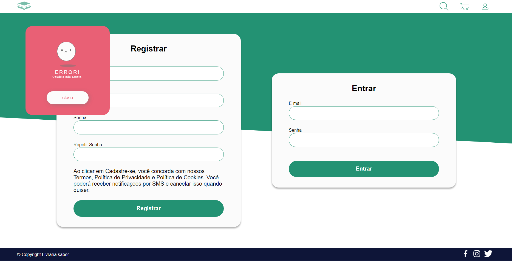
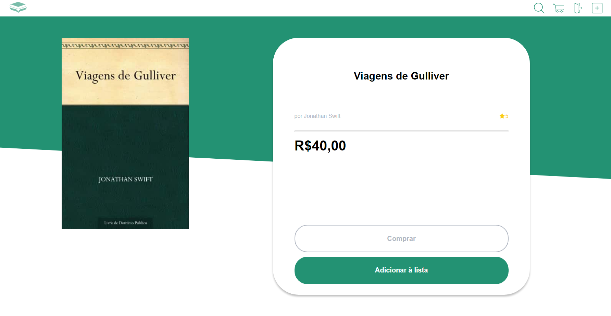
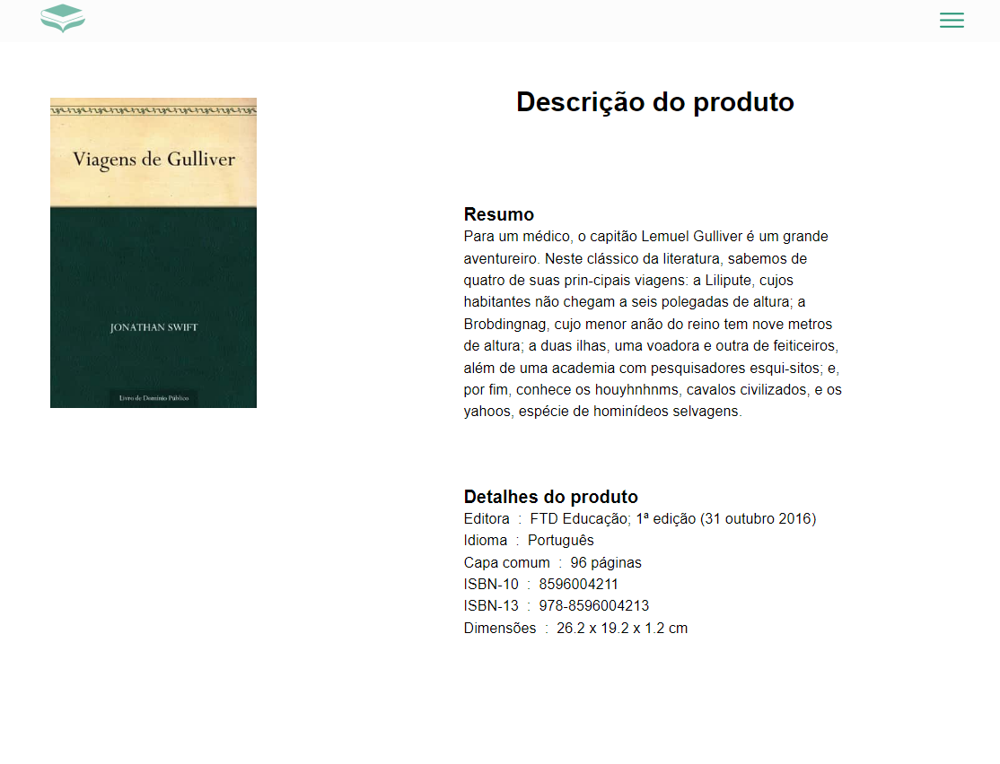
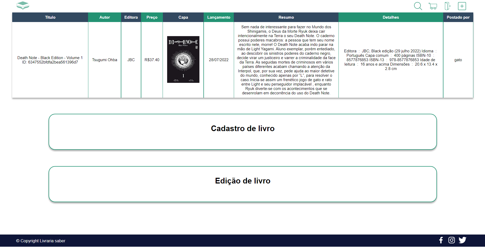
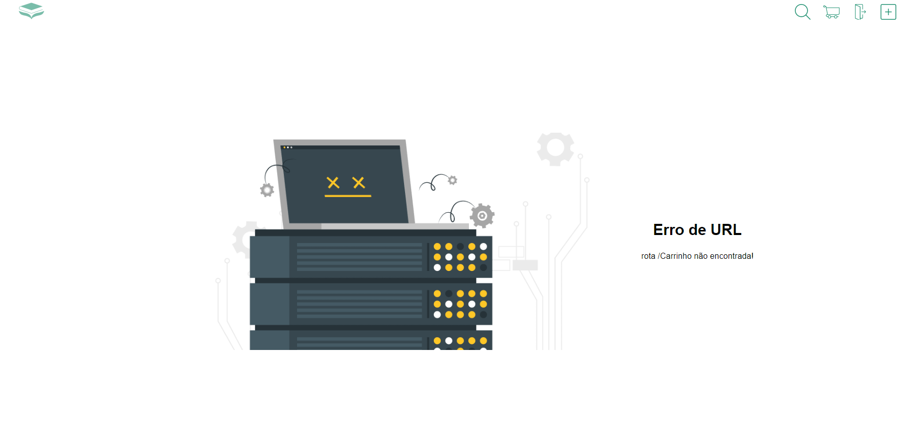
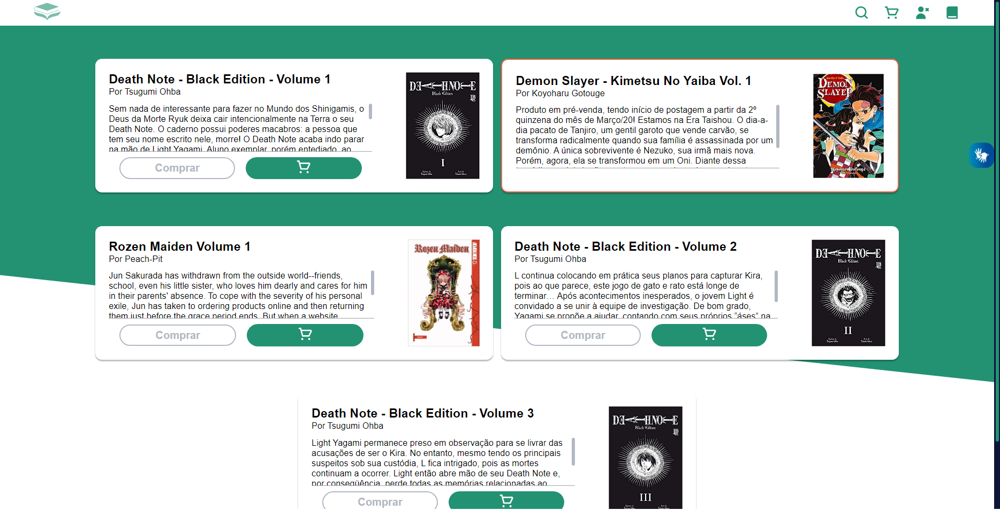
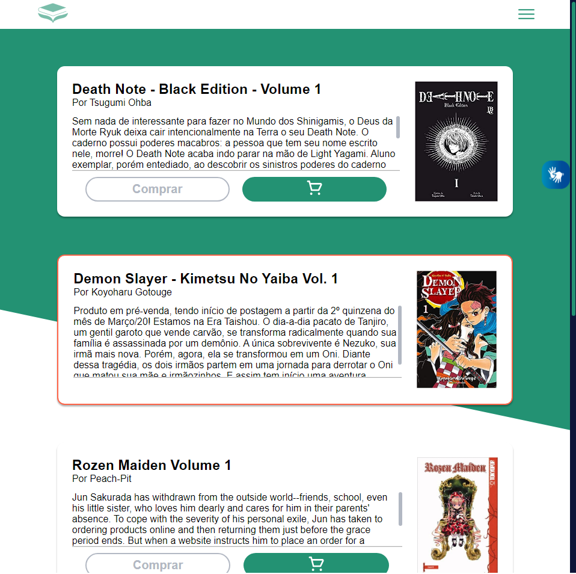

# Livraria Saber

Com o objetivo de desenvolver o mercado de trabalho da região, a L. SABER está selecionando os graduandos da turma 2022.2 do Curso de Gestão da Tecnologia da Informação da Faculdade Adventista da Bahia para serem responsáveis pelo execução do novo projeto.


## Preview










## Pré-requisitos

- Use o [NODE](https://nodejs.org/en/download/) para executar código JavaScript fora do navegador web.  
- Recomendo utilizar o [VSCODE](https://code.visualstudio.com) como editro de texto.

```bash
# IMPORTANDO A PASTA NODE_MODULE
npm i
```

### Inicializando

1. Digite git clone e cole a URL já copiada.

```bash
git clone https://github.com/MarshFfeco/Livraria_pdp.git
```

2. Pressione **ENTER** para criar seu clone local.

```bash
git clone https://github.com/MarshFfeco/Livraria_pdp.git
> Cloning into `Livraria_pdp`...
> remote: Counting objects: 10, done.
> remote: Compressing objects: 100% (8/8), done.
> remove: Total 10 (delta 1), reused 10 (delta 1)
> Unpacking objects: 100% (10/10), done.
```

3. Para executar o projeto faça os comandos a seguir.

```bash
# ATIVAÇÃO DO NODEMON
npm start

# ATIVAÇÃO DO WEBPACK
npm run dev
```

## CONTRIBUINDO PARA O PROJETO

1. Crie uma Branch

```bash
git checkout -b <nome_branch>
```

2. Adicione arquivos novos ou alterados em seu diretório de trabalho à área de teste do Git.

```bash
git add .
```

3. Commit o projeto.

```bash
git commit -m '<mensagem_commit>'
```

4. Selecione a branch que acabou de criar.

```bash
git branch -M <nome_branch>
```

4. Agora é so enviar.
```bash
git push 
```

## Tecnologias
- NODE
- EJS
- CSS
- JAVASCRIPT

## Equipe
<pre>
Adriel - Supervisor
ଲ( ⓛ ω ⓛ *)ଲ
</pre>
<pre>
    Anderson - Desenvolvedor
    ଲ( ⓛ ω ⓛ *)ଲ
</pre>
<pre>
      João - Redes e Infraestrutura
      ଲ( ⓛ ω ⓛ *)ଲ
</pre>
<pre>
        Lara - Marketing
        ଲ( ⓛ ω ⓛ *)ଲ
</pre>
<pre>
      Lucas - Segurança
      ଲ( ⓛ ω ⓛ *)ଲ
</pre>
<pre>
    Rômulo - Gerente de Projeto
    ଲ( ⓛ ω ⓛ *)ଲ
</pre>
<pre>
Saionara - Finança
ଲ( ⓛ ω ⓛ *)ଲ
</pre>

## Versão
- 3.10.2


